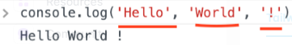

# Introducción

### console.log()

Es una funciona que imprime por la consola del navegador lo que ingresamos.

```js
console.log("Hola loca")
```



Ademas de eso el codigo 'console.log()' puede recibir mas de un parametro, que dan como resultado la concatenacion de los valores ingresados.

```js
console.log('Hola', 'Mundo', '!')
console.log('FELIZ', 'AÑO', 'NUEVO', 2020)
console.log('Bienvenido', 'a', 30, 'Días', 'de', 'JavaScript')
```

### Comentarios

Los comentarios sirven para documentar el codigo en partes clave, donde no quede claro una pedaso de codigo, se recomeinda no usar mucho los comentarios.

```js
// este es un comentario de una linea
console.log("Hola_1")

/*
Este es un comentario de varias lineas
*/
console.log("Hola_2")
```

### Incluir JS en una Pagina web

#### En linea

Podemos incluir codigo js en el mismo archivo .html, esta forma dice que incluiremos el codigo en la etiqueta html.

```html
<!DOCTYPE html>
  <html>
   <head>
     <title>30DíasDeJS:Inline Script</title>
   </head>

   <body>
     <button onclick="alert('Bienvenido a 30DaysOfJavaScript!')">Hazme Click</button>
   </body>
</html>
```

#### Script Interno

Un script interno se declara en el head en la etiqueta script, aunque es mas recomendable declarar la etiqueta script en el body.

```html
<!DOCTYPE html>
<html>
    <head>
    <title>30DíasDeJS:Scripts Internos</title>
    </head>
    <body>
	<button onclick="alert('Bienvenido a 30DaysOfJavaScript!');">Click Me</button>
	<script>
        	console.log("Bienvenido a 30DaysOfJavaScript!")
		// mas codigo js ...
    	</script>
    </body>
</html>
```

#### Script Externo

Un script externo se declara tambien con la etiqueta script, pero a diferecia del script interno, este recibe un  atributo 'src="./ubicacion"', la etiqueta script puede ser incluido en el head o en el body, pero lo recomendado es declararlo en el body.

```html
<!DOCTYPE html>
<html>
    <head>
     <title>30DíasDeJS:Scripts Externos</title>
    </head>
    <body>
    //Podría estar en la cabecera o en el cuerpo...
    // Aquí está el lugar recomendado para poner el script externo
    <script src="introduction.js"></script>
    </body>
</html>
```

## Variables

las variables son cajas,o mejor dicho espacios en memoria que nos permiten guardar un dato en el tiempo deejecucion, este dato puede ser un string, numero, boolean, etc.

Para declarar una variable en js usaremos las palabras reservadas *let, var y const*. 

Si la variable cambia de valor cada cierto tiempo usaremos lef, pero si su valor es constante como pi o la grabedad, usaremos `const`.

Para declarar una variable en js, se siguen los siguientes pasos:

- El nombre de la variable no puede comenzar por un numero.
- El nombre de una variable no permite caracteres especiales excepto el signo de dólar y el guion abajo.
- el nombre de las variables siguen la convención 'camelCase'.
- No se aceptan espacios entre palabras en el nombre de la variable.

Variables válidas

```javascript
primerNombre
apellido
ciudadCapital
estaCasado

nombre_de_pila
num
num_1
$num
año_2023
```

Variables inválidas

```javascript
primer-video
1_numero
num_#_1
```
